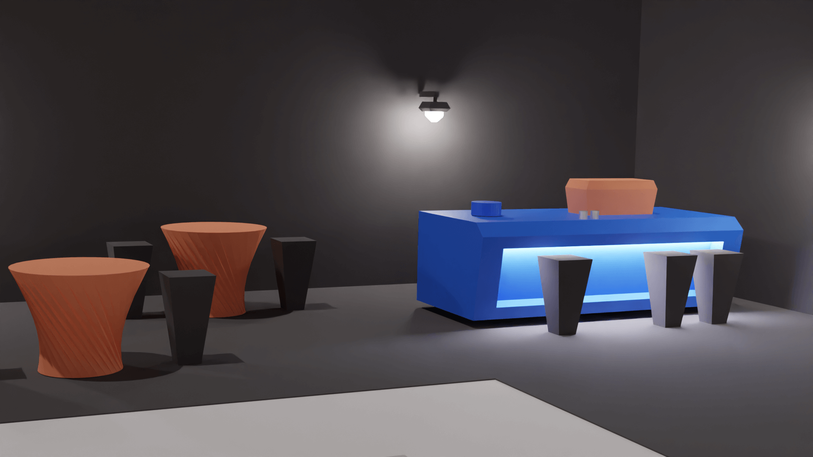

# Assets

Everything except your avatar is considered an asset and you can buy, sell, upgrade or even craft it. If the NFT token of an asset is registered to your avatar's wallet, it means you are the owner of that asset. One of the most popular assets is land (virtual property). Almost anything you can do in the real world with real estate can be done in The Landscape Metaverse. Here are a few things that you can build on virtual property. Note that these are only some of the things you can build and are only mentioned to familiarize you with the concept of virtual land.

* Private house
* Office, company or start-up
* Shops
* Coffee shop and restaurant
* Hotel
* Amusement Park
* Cinema
* Museum
* Zoo
* ...


<mark style="color:blue;">One of the easiest ways to earn money in The Landscape Metaverse is by owning land. You can earn money on your land without any restrictions.</mark>


### Types of assets

Assets do not just include land or virtual real estate. As mentioned, everything except your avatar (and the original smartwatch that belongs to the Avatar) is an asset and can be bought, sold, upgraded and crafted. A few of them are also mentioned here.

* Smartwatches with more advanced features and higher performance.
* Car
* Boat
* Clothes
* Jewlery
* Laptop
* And virtually everything that is implementable in The Landscape Metaverse.

Another popular asset is a banner or billboard where you can promote your business or other businesses and earn revenue. Soon this asset will be available in different designs and sizes and you can buy it.
