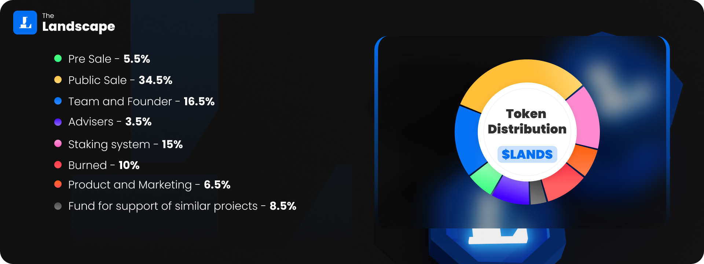

# Token economy

### **Information** 

| Description                            | Details                                                                |
| -------------------------------------- | ---------------------------------------------------------------------- |
| Name                                   | The Landscape                                                          |
| Symbol                                 |  LANDS |
| Decimal                                | 18                                                                     |
| Standard                               | ERC-20                                                                 |
| **Total supply** `Binance Smart Chain` | 1,000,000,000                                                          |
| **Total supply**  `Polygon Mainnet`    | 400,000,000                                                            |

## Token Distribution

| Hodlers                              | Weight    |
| ------------------------------------ | --------- |
| Pre Sale                             | **5.5%**  |
| Public Sale                          | **34.5%** |
| Team and Founder                     | **16.5%** |
| Advisers                             | **3.5%**  |
| Staking system                       | **15%**   |
| Burned                               | **10%**   |
| Product and Marketing                | **6.5%**  |
| Fund for support of similar projects | **8.5%**  |

